# Regrettamine data model

Scores, people, portfolio companies, legal matters, press, and sources live in Postgres (Supabase). The static site is a build of the **published** rows. A firm with no full report still appears on the list. Test rows are never published and never deployed.

The public page `/vc/<slug>/` is a **firm** (the management company: Andreessen Horowitz, Sequoia). A firm has many **funds** (vehicles: Fund I, a crypto fund, a growth fund). Scores are stored on the firm. A score row may optionally point at one vehicle.

Nothing that can grow is a fixed column or a fixed-length array. A firm does not have `partner_1` … `partner_N`. It has rows in `fund_people`. Portfolio companies, reviews, sources, matters, filings, press, takeaways, questions, and score inputs are all one-to-many or many-to-many.

## Diagram

```mermaid
erDiagram
  firms ||--o{ funds : vehicles
  firms ||--o{ fund_entities : entities
  funds ||--o{ fund_entities : "vehicle entities"
  people ||--o{ fund_people : "roles over time"
  firms ||--o{ fund_people : "at firm"
  funds ||--o{ fund_people : "at vehicle"
  firms ||--o{ investments : made
  funds ||--o{ investments : made
  portfolio_companies ||--o{ investments : received
  people ||--o{ investments : "board person"
  people ||--o{ company_founders : founded
  portfolio_companies ||--o{ company_founders : has
  firms ||--o{ reviews : about
  funds ||--o{ reviews : about
  portfolio_companies ||--o{ reviews : about
  people ||--o{ reviews : "founder or partner"
  reviews ||--o{ review_ratings : dimensions
  legal_matters ||--o{ legal_matter_firms : "links firms"
  firms ||--o{ legal_matter_firms : "role on matter"
  funds ||--o{ legal_matter_firms : "optional vehicle"
  legal_matters ||--o{ legal_matter_parties : parties
  legal_matters ||--o{ filings : filings
  filings ||--o{ docket_entries : entries
  legal_matters ||--o{ docket_entries : docket
  firms ||--o{ regulatory_records : records
  firms ||--o{ sanctions_checks : checks
  press_items }o--o{ firms : press_item_firms
  sources ||--o{ fact_sources : cited_by
  firms ||--o{ fact_sources : "in firm context"
  firms ||--o{ takeaways : takeaways
  firms ||--o{ ask_questions : questions
  score_versions ||--o{ score_sections : defines
  firms ||--o{ score_results : "firm-level score"
  funds ||--o{ score_results : "optional vehicle score"
  score_versions ||--o{ score_results : version
  score_results ||--o{ score_inputs : drivers
  score_results ||--o{ score_result_parts : parts
  score_results ||--o{ score_lines : "display lines"
  profiles ||--o{ report_views : viewed
  firms ||--o{ report_views : "report opened"
```

Page copy, evidence popups, homepage stats, and the update feed are also row tables (`copy_blocks`, `evidence_cards`, `evidence_lines`, `page_chips`, `list_items`, `portfolio_metrics`, `legal_groups`, `firm_meta_items`, `firm_ranks`, `site_stats`, `site_updates`). They are one-to-many from `firms`. `fact_sources` is the only link from a source URL to a fact, and a fact can have any number of them.

## Firms and vehicles

| Table | What a row is |
|---|---|
| `firms` | Management company. `slug` is the public id (`a16z`). `published` rows are readable by anyone. `is_test` rows cannot be published (`published AND is_test` is rejected). |
| `funds` | A vehicle of that firm: vintage, size, status, kind. Zero or many. |
| `fund_entities` | A legal entity (adviser, GP, management company). It may hang off the firm, a vehicle, or both. |
| `people` | A person, independent of any firm. The same person can show up at several firms over time. |
| `fund_people` | One role stint: person + firm + optional vehicle, role name, start date, end date. Partner moves are rows with an end date, not a status enum baked into the person. |

List columns on `firms` (`aum_billions`, `list_score`, `list_band`, …) are the homepage row. They are single values from the source file, not a collection. `list_sort` is the homepage order. `report_slug` is set only when a full report exists; otherwise the row stays “coming soon”.

## Portfolio

| Table | What a row is |
|---|---|
| `portfolio_companies` | A company, shared across firms. |
| `company_founders` | Founder (a `people` row) linked to a company, with optional title and dates. |
| `investments` | Firm + optional vehicle + company, round, date, lead flag, board seat, board person, outcome. |
| `portfolio_metrics` | Any number of stat rows (adverse-event buckets, health slices, size, litigation). Kind is a text label, not a column per metric. |

The fund page never paints every company into the first screen. It shows a page (24) and a “Show more” control. The rest sits in a JSON payload the page script reveals page by page. Firms with zero companies (a16z today: the source has counts, not the company list) omit the block, so the approved page does not grow an empty section.

## Reviews

`reviews` is one row per account: firm, optional vehicle, optional company, optional founder, optional partner, body, `first_hand`, `verification_status`, `moderation_status`, date. A review sent from the account form also stores `connection_type` (founder / CEO, co-founder, executive, employee, pitched, co-investor), the stage in `round_label`, and five rating columns: `honesty`, `support_after_check`, `founder_friendly_terms`, `responsiveness`, `hard_times`, each 1–5 or empty.

`linkedin_url` is stored only to check the review. `anon` and `authenticated` cannot select that column, and `published_site_bundle()` leaves it out, so it never reaches a public page.

`first_hand` and `verification_status` are not settable by a signed-in visitor. Those roles have no insert or update privilege on the two columns, and a before-trigger resets them to the server defaults (`false`, `unverified`). A moderator sets them later. Public reads still require `moderation_status = approved`. The author can read their own pending row, except the LinkedIn URL.

`review_ratings` is one row per dimension for reviews loaded as content (`treatment`, `support`, …). The account form writes the five ratings above as columns on `reviews` instead.

Reviews feed the founder-experience section of Toxy Score v2 when they are first-hand and verified. The a16z seed has no review rows, because the source file does not list any. The score uses the published inputs (2 negative first-hand accounts, under 1% of 1,456 companies) instead of invented reviews.

## Legal, regulatory, sanctions, press

| Table | What a row is |
|---|---|
| `legal_matters` | The matter itself. It can attach to several firms. |
| `legal_matter_firms` | The firm’s side: plaintiff / defendant / subject / other role, status, counted or not, relevance, points, and the list-row text. |
| `legal_matter_parties` | Any number of named parties. |
| `filings` | Filings on a matter. |
| `docket_entries` | Docket lines, optionally under a filing. |
| `legal_groups` | How a firm’s report groups matters. A group with `parent_id` set is the “show more” tail of that parent. |
| `regulatory_records` | SEC, DOJ, fines. Any number per firm or vehicle. |
| `sanctions_checks` | One screening result. Exact identity match is a flag. A name-only hit is not a sanction. |
| `press_items` | Publisher, URL, date, sentiment `pos` / `neu` / `neg`. |
| `press_item_firms` | The firms an article is about. |

## Sources

`sources` is one row per URL (`verified`, `junk`, publisher, domain).

`fact_sources` points that URL at a fact:

- `fact_type` — `evidence_card`, `legal_matter`, `press_item`, `takeaway`, `regulatory_record`, `sanctions_check`, `score_result`, `review`, `investment`
- `fact_id` — the row id
- `firm_id` — which firm’s page the citation belongs to (access control uses this)
- `label` — the citation text shown in the popup
- `sort_order`

A fact has zero, one, or many sources. A source can support many facts. Junk URLs stay in `sources` with `junk = true` and are not treated as verified evidence.

## Scores

Toxy Score v2 is a pure function of `score_inputs` (`regrettamine/score_v2.py`). The database keeps every run, so history is rows, not overwritten columns.

| Table | What a row is |
|---|---|
| `score_versions` | `v2`, `legacy-list`. |
| `score_sections` | The sections that version defines (v2: six sections, max points, kind). Methodology, not a firm’s result. |
| `score_results` | One computation for a firm, or for one vehicle when `fund_id` is set. `total`, band, likely range, `coverage_pct`, `confidence`, `is_current`, `computed_at`. Older runs stay with `is_current = false`. |
| `score_inputs` | The numbers the function reads (portfolio size, event counts, departures, penalties). Any number of named inputs. |
| `score_result_parts` | The section scores as shown on the page, including the approved wording. |
| `score_lines` | The “input / points / why” lines under each section. |

Coverage and the likely range sit on the result. They do not change the 0–100 score. A legacy list score (the other ten firms) is a `legacy-list` result with a total and no v2 inputs. Those numbers are the ones already in `data/home.json`.

## Page content

These tables exist so the site can be rebuilt from the database without inventing copy:

- `copy_blocks` — keyed text (`summary`, `verdict`, `ask_clipboard`, section headings). Missing key means that piece is empty.
- `evidence_cards` + `evidence_lines` — popup title, body, and label/value rows.
- `page_chips` — hero floats and badges.
- `list_items` — fund-tab tiles (facts, board seats, partner moves, media), any length.
- `firm_meta_items` — the small meta line and the “not counted” bullets.
- `firm_ranks` — rank snapshots; the current one is shown. Marked as an example when the source says so.
- `site_stats`, `site_updates` — the homepage figures and the update feed.

Takeaways and ask questions are their own tables, any length.

## Access

Row level security is on for every public table.

- **Anon and authenticated** can `select` a firm only when `published` and not `is_test`, and can `select` child rows only when `firm_is_public(firm_id)` is true. Shared rows (people, companies, sources, matters) are visible only when some public firm references them.
- **Writes** require `profiles.is_admin` for the signed-in user (`auth.uid()`). There is no anon insert on content tables.
- The table owner and the Supabase `service_role` bypass RLS, which is how the seed runs.

`published_site_bundle()` returns one JSON document of the published, non-test rows. The site build calls it with the anon key. The function also filters `published and not is_test` itself, so a test firm cannot ride along.

## Accounts, watchlist, alerts

| Table | Role |
|---|---|
| `profiles` | One row per `auth.users` id, created by the `on_auth_user_created` trigger. `is_admin` is the content-write switch. |
| `watchlist` | One row per (profile, firm). A before-insert trigger rejects the 101st firm for that person. |
| `alert_preferences` | Four booleans per person: new legal matter, regulatory record, partner exit, score change. Created with the profile. Stored only — nothing sends email yet. |
| `gating_policies` | The numbers (2, 5, 2000 ms). One policy row, `code = default`. |
| `report_views` | One row per (account, firm) or (device `anon_key`, firm). `counted` flips after the dwell. Re-opening a firm is free. |

Anonymous views live in the browser until sign-up, then the same firms are copied onto `report_views` and count toward the 7. A review submitted from the account form is `moderation_status = pending` and is not readable by anyone except its author and an admin, so it cannot appear on a public fund page.

## Gating

From `gating-plan.md`: 2 reports anonymous, register, 5 more (7 total), then a plans placeholder with no prices. A view is a unique firm, counted once it has stayed open at least 2 seconds. The extra 5 wait until the email is confirmed. Google accounts are confirmed by the provider.

## What the seed is allowed to insert

`scripts/seed.py` loads `data/home.json` and `data/funds/a16z.json` only.

- Eleven firms, homepage stats, and the eight updates.
- The full a16z report: score, matters, press, takeaways, questions, evidence, sources, and the people and board seats named in that file.
- No invented vehicle list, no invented 1,456 companies, no invented reviews, no invented filings. Those tables stay empty for the real firms until a sourced row is added.
- The other ten firms get a `legacy-list` score equal to the list score already in `home.json`, and no report page.

`scripts/stress_fixture.py` is separate. It inserts one firm, `slug = stress-fixture`, `is_test = true`, `published = false`: 3 vehicles, 20 people, 1,000 portfolio companies, 100 reviews, 150 sources. The check constraint stops it from being published. The site build never selects it.
